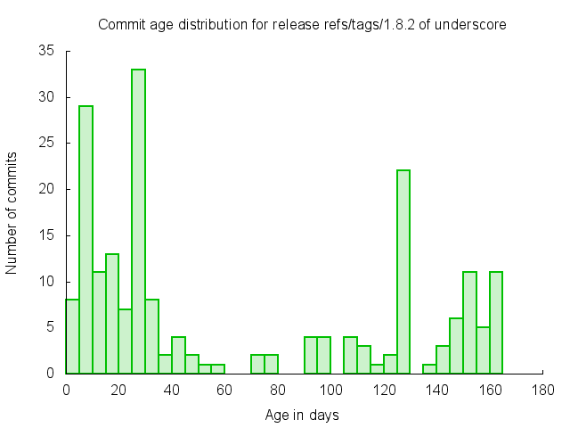

Code that's unreleased/undeployed/not-in-production is a common form of technical debt that can incur costly interest charges over time.

The aim of this small project is to visualize this debt.

## Sample

